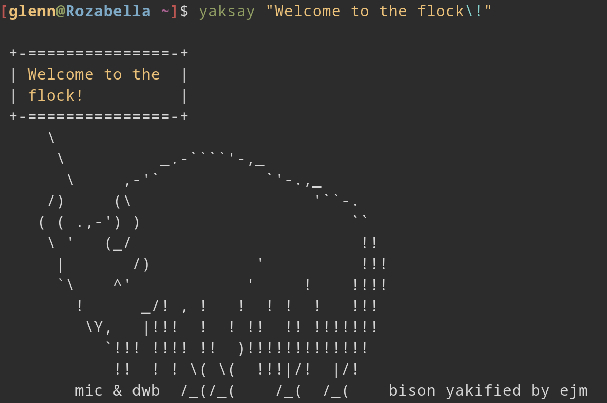

# Yaksay &ndash; Cowsay enhanced

To install the program, run `cargo install yaksay` in your terminal. If you haven't changed your cargo install directory, it will be installed to the `.cargo/bin/` folder.

Running the command `yaksay` in the terminal will spawn the default yak saying "Mooh!" as seen above. The program can of course also be run with a custom input string, like `yaksay "Hello, World!"`. This can be seen below. (Be aware that it might be required to prepend a backslash to exclamation marks and other special characters like so: '\\!'). It is possible to color the message differently by setting a color using the color flag, i.e., `yaksay -c green` will display the default message in green. 

Running yaksay like so: `yaksay -w <number>`, appending the `--width` flag, one is able to set the desired width (measured in characters) of the sentences before wrapping. If a sentence is not long enough to wrap at the desired length, the borders will shrink and snap to the text. The default width is 15 characters.

It is also possible to pass custom ascii to the program to be output instead of the default yak. This can be done with the command `yaksay -f path/to/ascii.*` (the asterics denoting that file type doesn't matter). 

Keep in mind that there are essentially four states the yak can be in when printed, namely **happy** (default), **bored**, **surprised**, or **dead**. The yak cannot be in either one of these states at the same time and as of now, the program will pick among the given states and print an error message before the yak, informing the user that the yak collapsed to one of the given states (assuming it's a quantum yak).

To print helpful information, run the program with the `-h` flag. An extensive table of commands and related behavior can be found below.

## Command - Behavior table

| Flags and options                                | Behavior                                                                                                                        |
|--------------------------------------------------|---------------------------------------------------------------------------------------------------------------------------------|
| `<message>`                                      | Message from the yak (default: `Mooh!`).                                                                                        |
| `-h`, `--help`                                   | Prints helpful information described in this table.                                                                             |
| `-d`, `--dead`                                   | Spawns a dead cow instead of the default live one.                                                                              |
| `-b`, `--bored`                                  | Spawns a bored cow instead of the default happy one.                                                                            |
| `-s`, `--surprised`                              | Spawns a surprised cow instead of the default happy one.                                                                        |
| `-i`, `--stdin`                                  | Passes text from STDIN to the program (could be used like: `echo "Hello, World!" \| yaksay -i`).                                |
| `-V`, `--version`                                | Prints version information.                                                                                                     |
| `-c <color>`, `--color <color>`                  | Sets the color for the message to printed in (default: `yellow`).                                                               |
| `-w <number>`, `--width <number>`                | Sets the wrapping width of the text in characters (default: `15`).                                                              |
| `-f <path/to/file.*>`, `--file <path/to/ascii.*>`| Prints custom ascii from file. The program reads the whole file to a string, so nothing but the ascii art should be in the file.|

## Features

- [x] Sentence wrapping
- [x] Abundance of expressions
- [x] Display message in color
- [x] Ability to load custom ascii
- [ ] Different border styles
- [ ] More ascii-yaks to choose from
- [ ] External storage of ascii-yaks
- [ ] Implicitly read input from STDIN if detected

Ideas are welcomed with great enthusiasm!

## ASCII-credits

The default ascii art of the yak is assumingly a product of an "Ejm". Thank you Ejm, for yakifying the bison.
